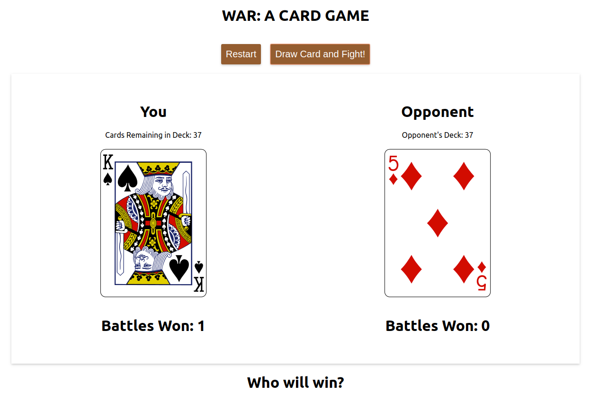

### War: a card game

I wanted to better understand the store -> state -> UI -> action -> reducer paradigm that Redux makes use of, so I recreated the card game War in Redux using the [deck of cards API](deckofcardsapi.com). 

Currently, every instance of this open in a browser makes use of the same deck of cards, so if someone else plays this while another person has it open, the same deck will end up modified. This would be corrected by generating a new url for each game instance.

### Details

Used create-react-app to generate it, and then made use of the following packages:
- redux
- react-redux
- redux-thunk (for asynchronous functionality)
- redux-logger (to view the HTTP requests being made)
